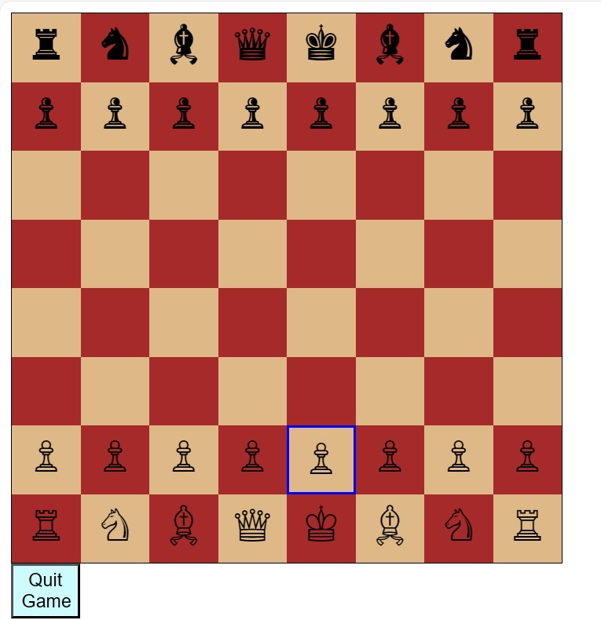
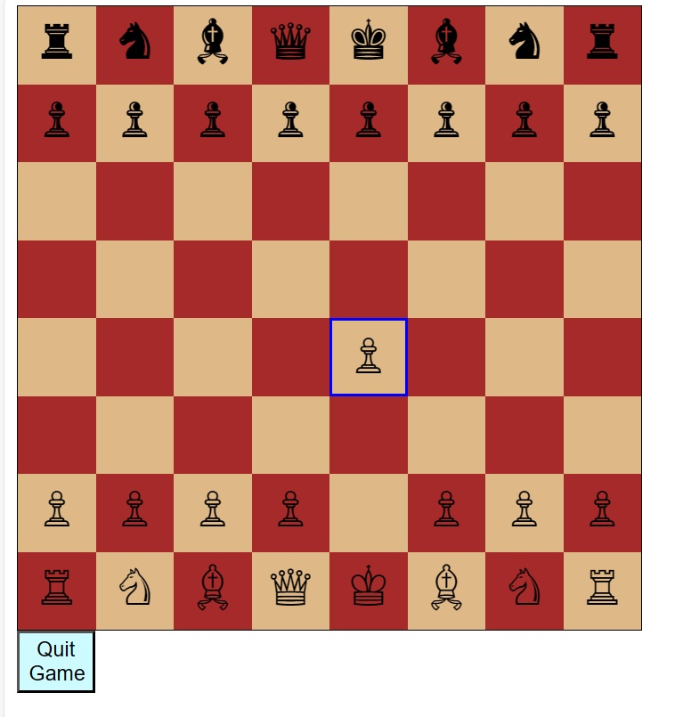

# Casual Chess Software

## Overview
Casual Chess Software is a simple web application that allows users to play casual chess in their web browsers. The project is built using HTML, CSS, and JavaScript.

## Features
- Display a chessboard with alternating colors for squares.
- Generate the initial chessboard layout.
- Basic styling for a pleasant user interface.
- [Optional] Add chess piece images.
- [Optional] Implement piece movements.
- [Optional] Handle user input for moving pieces.
## Milestones

### 1. Design (UML Diagrams)
- [x] Create UML diagrams outlining the project structure.
- [x] Review and finalize the design.

### 2. Programming (HTML, CSS, and JS)
- [x] Set up the basic project structure with HTML, CSS, and JavaScript files.
- [x] Implement the chessboard layout and styling.
- [x] [Optional] Add chess piece images.
- [x] [Optional] Handle user input for moving pieces.
- [x] Implement Pawn movement
- [ ] Implement Bishop movement
- [ ] Implement Rook movement
- [ ] Implement Knight movement
- [ ] Implement King movement
- [ ] Implement Queen movement
### 3. Testing
- [ ] Develop and execute unit tests for critical functions.
- [ ] Perform user testing to identify and fix issues.
- [ ] Conduct thorough testing to ensure a stable application.

### 4. Project Deadline (1 Jan)
- [ ] Ensure all features are implemented.
- [ ] Conduct final testing and bug fixing.
- [ ] Prepare for project submission.

## Getting Started
1. Clone the repository: `git clone https://github.com/GivenChauke/CasualChessGame.git`
2. Open `index.html` in your web browser on a live server since current web browers do not support js files as modules otherwise you will see a cross-origin error

## Usage
- The chessboard is displayed on the page.
- [Optional] Click on a piece to select it.
- [Optional] Click on a valid square to move the selected piece.

## Screenshots
- 

## Contributing
Contributions are welcome! Please follow our [Contribution Guidelines](CONTRIBUTING.md).

## Acknowledgments
- Chess Piece use the UTF8 representations of a chessPiece, the decision is for ease of   use and code especially when coding without internent connection

## Future Enhancements
- Potentially more game modes such as single player against a Chess engine at varying degrees of strength

## Author
Given Chauke

## Contact
chaukemnashe123@gmail.com

